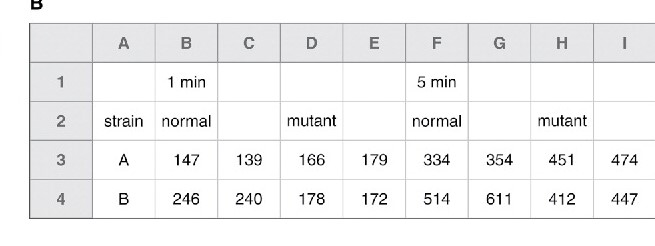
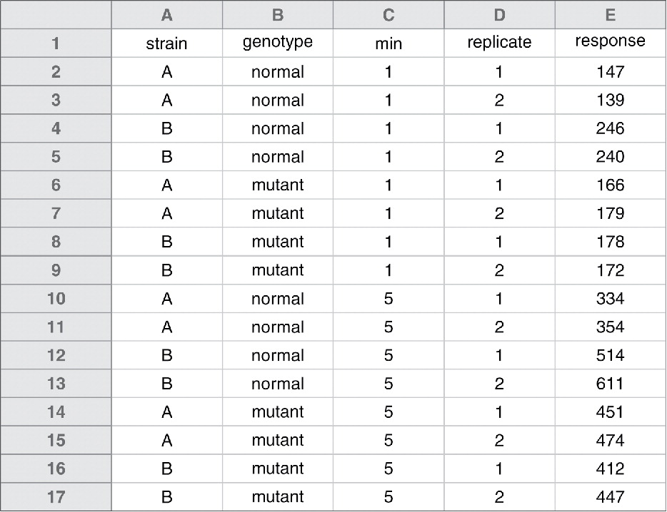

```{r setup, include=FALSE}
knitr::opts_chunk$set(echo = TRUE)
```

These recommendations are based on Broman and Woo 2017 (https://doi.org/10.1080/00031305.2017.1375989). 

The very first thing that we do when we start a data anlaysis project is import a tabular (rectangular) data that is stored in a spreadsheet (MS Excel, Google Spreadsheet, OpenOffice, Numbers). A lot of time is spent cleaning and troubleshooting these sheets if these are not entered consistently. In addition, certain software store different types of data differently, and that could lead to misinterpretations by R or other software you will be using for your data analysis. For example:

> Microsoft Excel converts some gene names to dates and stores dates differently between operating systems, which can cause problems in downstream analyses (Zeeberg et al. 2004; Woo 2014).

Here are the key recommendations for entering data in spreadsheets from Broman and Woo, 2017. You might be following some of these already, but I am sure that you will learn something new that you have not previously considered. These recommendations will help you enter data in spreadsheets, so that your data is both computer and human readable.

1. **Use spreadsheets only for data entry and storage.** Don't use them for visualization and analysis. Doing visualization and analysis within spreadsheets can increase the risk of cotaminating your raw data.

2. **Be consistent**

    a. *Use consistent codes for categorical variables.* e.g. for a variable named gender, consistently use `male` or `M`. Do not use `male` in some sheets and `M` in others.
    
    b. *Use a consistent code for any missing values.* R users prefer "NA" for missing values. SAS users prefer "." for missing values. Whichever you use, be consistent, and avoid using numeric values like 999 or -999.
    
    c. *Use consistent data layout in multiple files.*
    
    d. *Use a consistent format for all dates.* Preferably, use the standard format YYYY-MM-DD
    
    e. *Be careful with extra spaces in cells.* For example, if you have a numeric column named `yield` in your spreadsheet, and one of the cell has an extra space, R will import that column as a character vector by default. This can lead to mistakes and unexpected errors in your analysis down the road and an unexpected errors.

3. **Choose good names for things**

As a general rule, don't use spaces in file names and variable names in your dataset. For example, use `2020-konza-location-1.csv` is a better than `2020 Konza Location 1.csv`. Here are some good and bad examples for variable names:

|Good name         |Bad name          |
|------------------|----------------- |
|max_temp_c        |Max Temp (C)      |
|mean_year_growth  |Mean growth/year  |
|sex               |M/F               |
|cell_type         |Cell Type         |

4. **Write dates as YYYY-MM-DD**

This is the global "ISO 8601" standard.

See this xkcd comic:


5. **No empty cells**

The below image is a non-tidy way of entering an assay data:



And, here is tidy way of entering the above data that will not create headache when you import it into R or other software you are planning to use.



6. **Put just one thing in a cell**

>For example, you might have a column with “plate position” as “plate-well,” such as “13-A01.” It would be better to separate this into “plate” and “well” columns (containing “13” and “A01”), or even “plate,” “well_row,” and “well_column” (containing “13,” “A,” and “1”).

7. **Make it a rectangle**

>The best layout for your data within a spreadsheet is as a single big rectangle with rows corresponding to subjects and columns corresponding to variables. The first row should contain variable names, and please do not use more than one row for the variable names. 

8. **Create a data dictionary**

>It is helpful to have a separate file that explains what all of the variables are. It is helpful if this is laid out in rectangular form, so that the data analyst can make use of it in analyses.

Here is an example of a data dictionary:


Where, `name` column contains exact variable names as in the data file, `plot_name` contains a version of the variable names to use in plots (visualizations)
